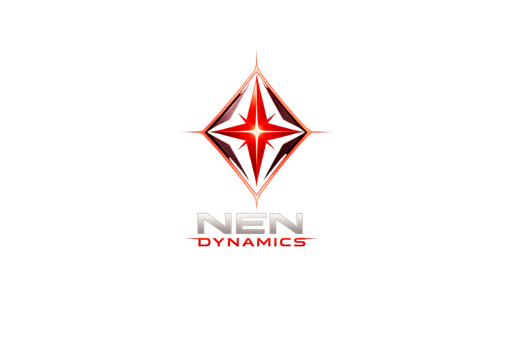
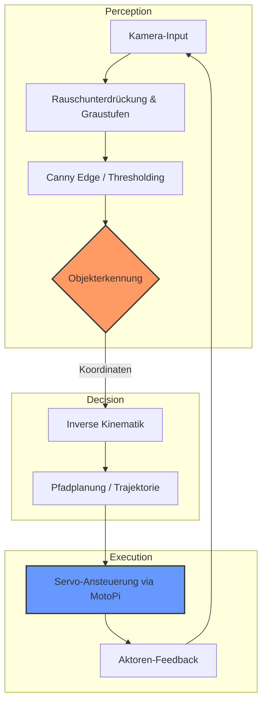

<p align="center">
  
</p>

# NEN DYNAMICS - KI-gesteuerter Roboterarm 🤖

[](https://www.python.org/)
[](https://opencv.org/)
[](https://opensource.org/licenses/MIT)
[](https://github.com/scorpyxn/nen-dynamics-robotic-arm)

Willkommen im Repository von **NEN DYNAMICS**. Dieses Projekt befasst sich mit der Entwicklung und Integration eines KI-gestützten Roboterarms, der autonom Objekte erkennt, klassifiziert und präzise zu einem Turm stapelt.

---

## 📖 Inhaltsverzeichnis
- [📌 Projektübersicht](#-projektübersicht)
- [✨ Kernfeatures](#-kernfeatures)
- [⚙️ Software-Architektur](#️-software-architektur)
- [🛠 Technologien & Spezifikationen](#-technologien--spezifikationen)
- [📂 Projektstruktur](#-struktur)
- [🚀 Schnellstart](#-schnellstart)
- [📅 Meilensteine](#-meilensteine-zeitplan)
- [🤝 Mitwirken & Kontakt](#-mitwirken--kontakt)

---

## 📌 Projektübersicht
Im Zeitraum von **April bis Mai 2026** realisieren wir eine intelligente Steuerung für einen industriellen Lehr-Roboterarm. Das Kernziel ist die Vollautomatisierung eines Logistik-Vorgangs:
1. **Erkennen** von Objekten über eine Top-Down Kamera.
2. **Klassifizieren** der Bausteine nach Typ und Farbe.
3. **Berechnen** der optimalen Trajektorie und Greifpunkte.
4. **Stapeln** der Objekte zu einer stabilen Turmstruktur.

---

## ✨ Kernfeatures
- **Intelligente Objekterkennung:** Echtzeit-Identifikation von bis zu 6 verschiedenen Objekttypen mittels OpenCV Konturanalyse.
- **Präzisions-Greifen:** Automatisierte Berechnung der Greifpunkte unter Berücksichtigung der Objektgeometrie.
- **Autonomer Turmbau:** Ein hochentwickelter State-Machine-Algorithmus steuert den Stapelprozess von 3 Objekten ohne menschliches Eingreifen.
- **Sicherheits-Logik:** Multi-Layer Sicherheitskonzept mit integriertem Software-Not-Halt und physikalischer Grenzwertüberwachung.

---

## ⚙️ Software-Architektur & Workflow

Das System basiert auf einem modularen **Vision-to-Action** Framework:



### Die Ebenen (Layer):
> [!NOTE]
> **Vision Layer:** Nutzt OpenCV zur Segmentierung und Merkmalsextraktion (Shape, Size, Color).
>
> **Logic Layer:** Berechnet mithilfe von NumPy die Gelenkwinkel für den Roboterarm (den "TCP" - Tool Center Point).
>
> **Control Layer:** Kommuniziert über die serielle Schnittstelle mit dem MotoPi-Board, um PWM-Signale an die Servos zu senden.

---

## 🛠 Technologien & Spezifikationen

### 💻 Software
- **Sprache:** Python 3.10+
- **Bibliotheken:**
  - `OpenCV` (Bildverarbeitung)
  - `NumPy` (Vektormathematik)
  - `PySerial` (Hardware-Kommunikation)

### 🏗 Hardware
- **Base:** 6-Achs Roboterarm (Metall-Konstruktion)
- **Computing:** Raspberry Pi 4 (4GB RAM)
- **Controller:** Joy-IT MotoPi Servo-Board
- **Optik:** 5MP Weitwinkel-Kamera (CSI-Interface)

---

## 📂 Struktur
```text
├── docs/               # Dokumentation & Testprotokolle
├── src/                # Quellcode-Basis
│   ├── vision/         # Bildverarbeitung & KI-Module
│   ├── control/        # Kinematik & Motor-Treiber
│   └── main.py         # Zentraler Programm-Einstiegspunkt
├── assets/             # Grafiken, Logos & Screenshots
├── tests/              # Unit-Tests für Kinematik & Vision
└── README.md           # Diese Dokumentation
```

---

## 🚀 Schnellstart

### 1. Umgebung vorbereiten
```bash
# Repository klonen
git clone https://github.com/scorpyxn/nen-dynamics-robotic-arm.git
cd nen-dynamics-robotic-arm

# Virtuelle Umgebung erstellen (empfohlen)
python -m venv venv
source venv/bin/activate # Windows: venv\Scripts\activate
```

### 2. Abhängigkeiten installieren
```bash
pip install opencv-python numpy pyserial
```

### 3. Ausführung
```bash
python src/main.py
```

---

## 📅 Meilensteine (Zeitplan)
- [x] **Phase 1:** Mechanisches Hardware-Setup (100%)
- [/] **Phase 2:** OpenCV Integration & Marker-Erkennung (Läuft)
- [ ] **Phase 3:** Entwicklung der Inversen Kinematik (Geplant für KW 17)
- [ ] **Phase 4:** Autonomer Testlauf & Optimierung (Geplant für KW 19)

---

## 🤝 Mitwirken & Kontakt
**NEN DYNAMICS Team**  
Gemeinsam entwickeln wir die Zukunft der Desktop-Robotik.

- **Status:** 🟠 In aktiver Umsetzung (Beta)
- **Team:** [NEN DYNAMICS Team](http://nen-dynamics.de)
- **Support:** Bei technischen Fragen bitte ein Issue im Repository eröffnen.

---
<p align="center">
  <small>© 2026 NEN DYNAMICS. Alle Rechte vorbehalten.</small>
</p>
